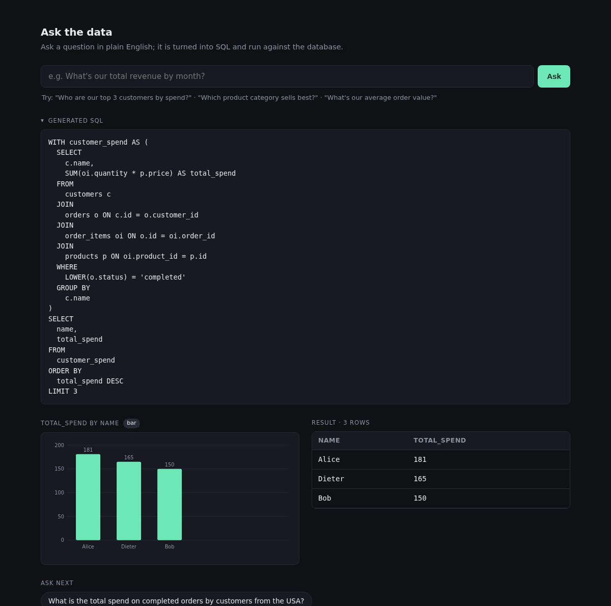
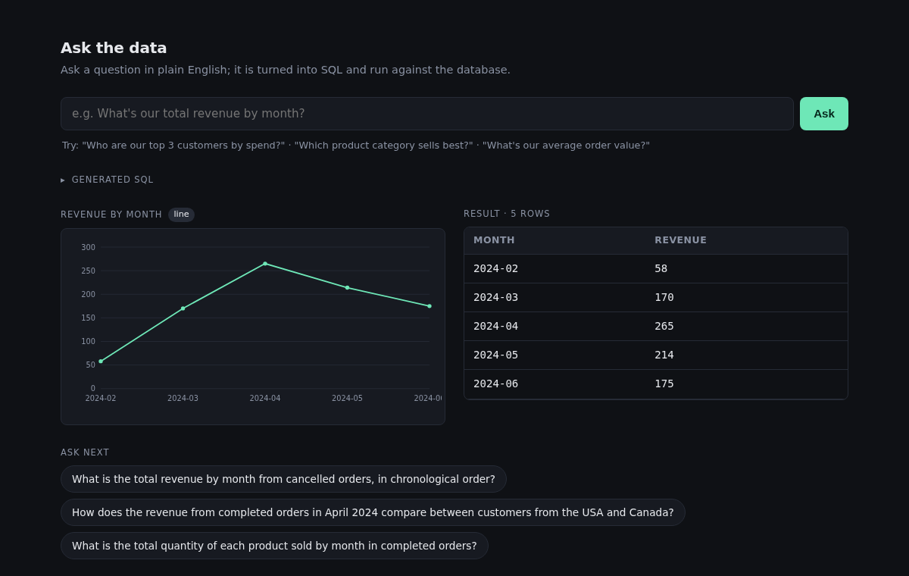
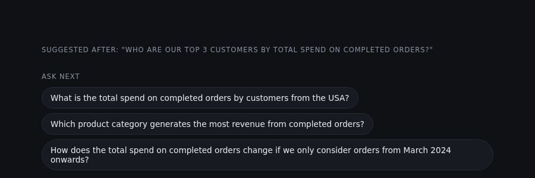

# LLM SQL Agent

A natural-language-to-SQL agent built on [LangGraph](https://langchain-ai.github.io/langgraph/).
Ask a question in plain English; the agent writes SQLite SQL, runs it read-only,
recovers from errors by feeding them back to the model, and returns the result
with an auto-generated chart and suggested follow-up questions.

Built for the take-home exercise in [CANDIDATE.md](CANDIDATE.md). The web server,
database, and read-only query execution were provided; the agent
([`app/agent.py`](app/agent.py)) and the frontend extensions are the work here.

## Demo

<!--
  Save your screenshots into docs/images/ with these exact filenames and the
  images below will render automatically:
    docs/images/app-overview.png  - a question with its SQL, chart, and table
    docs/images/line-chart.png    - a time-series question (line chart)
    docs/images/suggestions.png   - the follow-up suggestion chips
    docs/images/eval.png          - the eval self-check passing in the terminal
-->



| Time-series chart | Follow-up suggestions |
| --- | --- |
|  |  |

## What it does

1. Loads the database schema and a profile of the real data.
2. Asks the LLM for a single read-only `SELECT`.
3. Runs it with the provided read-only executor.
4. On a SQL error, feeds the error back to the model and retries, up to a cap.
5. Returns the final SQL, columns, rows, attempt count, and a chart spec.

## Architecture

The agent is a small LangGraph state machine:

```
START -> generate_sql -> run_sql -> (router) -> success -> visualize -> END
              ^                         |
              |__ retry (attempts < MAX)|__ attempts >= MAX -> give_up -> END
```

- **generate_sql** - prompts the LLM; on a retry the previous SQL and its error
  are included so the query can be corrected.
- **run_sql** - executes the query; on failure the error is stored for the router
  and the next attempt.
- **router** - stops on success, retries while under the attempt cap, otherwise
  gives up with the last error.
- **visualize** - attaches a chart spec when the result is chartable.

A transient LLM API failure ends the run gracefully with an error message rather
than crashing the request.

## Key design decisions

**Data-aware prompting.** The bare `CREATE TABLE` schema hides things that change
query correctness, so the prompt is augmented with a generated data profile:

- small lookup tables (e.g. `fx_rates`) dumped in full,
- distinct values of categorical columns,
- a format note for timestamp columns,
- an explicit, computed list of columns whose values have inconsistent
  casing/whitespace, so normalization (`LOWER(TRIM(...))`) is applied only where
  the data actually needs it rather than guessed at.

This profile is built read-only from `SELECT`s and cached per process.

**Domain conventions in the prompt.** Ambiguous business terms (revenue vs.
amount paid, gross vs. net, "by month", "active customer") are defined explicitly
so the agent resolves them consistently across runs.

## Extra features (beyond the brief)

- **Auto-charting.** A deterministic heuristic inspects the result shape and
  emits a chart spec (bar for categories, line for time series, none for scalars).
  The frontend renders it as a self-contained inline SVG with labelled axes - no
  charting library or external assets.
- **Follow-up suggestions.** After each answer, the agent proposes three
  contextual next questions (grounded in the schema and result) as clickable
  chips. This runs as a separate best-effort call so it never delays or breaks
  the main answer.

## Results

The repo includes a self-check (`eval/`) that compares result sets against the
expected answers.

| Dataset | Result |
| --- | --- |
| Base (`seed.sql`) | 6 / 6 |
| Hard (`seed_hard.sql`) | 9-10 / 10 |

The hard dataset adds the realistic traps: mixed-case statuses, multi-currency
orders, free-text categories, and ISO timestamps. The one occasional miss is on
the hardest multi-step net-revenue question and reflects model variance.

## Running it

Requires Python 3.11+, [uv](https://docs.astral.sh/uv/), and an OpenAI API key.

```bash
uv sync
export OPENAI_API_KEY=sk-...
uv run uvicorn app.main:app --reload      # then open http://127.0.0.1:8000
```

The database is created and seeded automatically on first run. The model defaults
to `gpt-4o` and can be overridden:

```bash
AGENT_MODEL=gpt-4o-mini uv run uvicorn app.main:app --reload
```

Run the self-check:

```bash
uv run python -m eval.run_eval                 # base dataset
uv run python -m eval.run_eval -v              # also print SQL and output
DB_FILE=shop_hard.db SEED_FILE=seed_hard.sql uv run python -m eval.run_eval   # hard dataset
```

## Project layout

```
app/
  agent.py           the agent: LangGraph loop, data profiling, charting, suggestions
  main.py            FastAPI routes (provided; extended with /api/suggest)
  db.py              schema + read-only query execution (provided)
  static/index.html  frontend: question box, SQL view, chart, table, suggestions
eval/                result-set self-check
seed.sql             base dataset
seed_hard.sql        larger dataset with messier data
```
